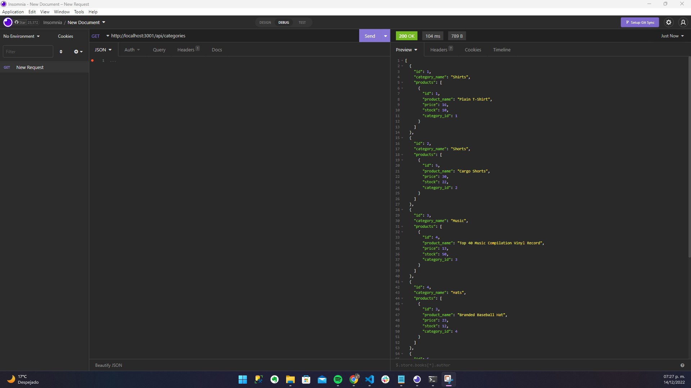

# e-commerce
## Challenge Module 13
### Último cambio: Mauricio García Hernández 14/Dec/2022

### User Story:
COMO gerente en una empresa minorista de Internet
DESEO un back end para mi sitio web de comercio electrónico que utilice las últimas tecnologías
PARA QUE mi empresa pueda competir con otras empresas de comercio electrónico

### Criterios de aceptación:
DADA una API funcional de Express.js 
CUANDO agrego el nombre de mi base de datos, el nombre de usuario MySQL y la contraseña de MySQL a un archivo de variable de entorno
LUEGO puedo conectarme a una base de datos usando Sequelize
CUANDO ingreso los comandos schema y seed
LUEGO se crea una base de datos de desarrollo y se ingresan datos de prueba
CUANDO ingreso el comando para invocar la aplicación
LUEGO mi servidor se inicia y los modelos de Sequelize se sincronizan con la base de datos MySQL
CUANDO abro rutas GET de API en Insomnia Core para categorías, productos o etiquetas
LUEGO, los datos de cada una de estas rutas se muestran en formato JSON
CUANDO pruebo las rutas POST, PUT y DELETE de la API en Insomnia Core
LUEGO puedo crear, actualizar y eliminar datos correctamente en mi base de datos
ENTONCES se me pide que seleccione un empleado para actualizar y su nuevo rol y esta información se actualiza en la base de datos

* Repositorio: https://github.com/maugh108/e-commerce
* Video: https://drive.google.com/file/d/1aPzPG7eRVEBmtmhciMFhI5V0g90F2MvS/view